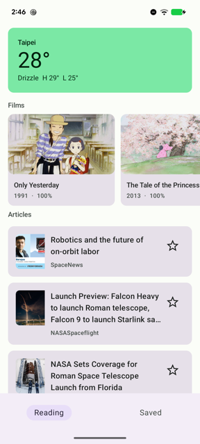
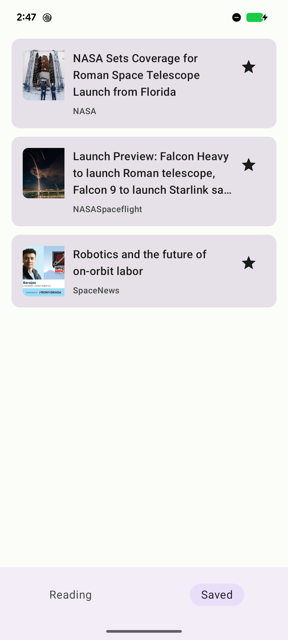
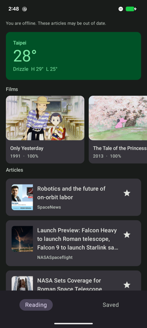
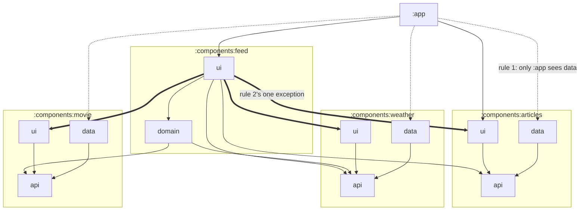
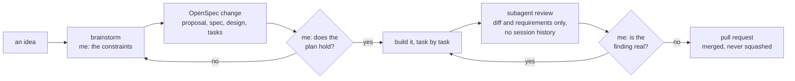

# TodayFeed

A content feed app in the style of LINE TODAY. One scrollable list holds a weather card, a
row of films and a page-by-page list of articles. Open an article, save it, and read what you
saved with no network.

## Run it

```bash
./gradlew assembleDebug
```

That is the whole thing, on a machine with a JDK 17 and the Android SDK.

Gradle needs to know where the SDK is, through `ANDROID_HOME` or a `sdk.dir` line in
`local.properties`. Android Studio writes that file the first time it opens a project, and
every Android project needs it, so it is not something this one adds.

Beyond that there is nothing to configure. No API keys, no secrets, no local files to create,
because every data source is keyless. CI runs the same command with no secrets
configured, so every push checks that this is still true.

To put it on a device: `./gradlew installDebug`.

## What is in it

| Screen | Shows |
|---|---|
| Reading | the feed: a weather card, a row of films best rated first, then a paginated list of articles |
| Detail | one article, readable offline once saved |
| Saved | the articles you kept |

Data comes from three free APIs that need no key: [Spaceflight
News](https://api.spaceflightnewsapi.net/v4/articles/) for articles,
[Open-Meteo](https://api.open-meteo.com/v1/forecast) for weather and the [Studio Ghibli
API](https://ghibliapi.vercel.app/films) for films.

Each band of the feed carries its name, so one kind of content cannot be taken for another. The
films are ordered by review score, best first; the articles by when they were published.

| The feed | Saved, with the wifi off | Offline, in dark |
|---|---|---|
|  |  |  |

Taken on a Pixel 6. The first shot is the mixed feed the brief asks for: one list holding a
weather card, a row of films and article cards, and no reader could take one of them for
another. The second was taken with the wifi off, so those saved articles and their pictures are
coming back from storage. The third is the same feed offline in dark, with the line that says
so.

## How it is built

Component-based Clean Architecture. A component is one area of subject matter, and the four
layers `api`, `domain`, `data` and `ui` are the shape it takes. A layer is created only when
there is something to put in it, which is why not every component below has all four. Two rules
carry the design, and the build enforces both:

1. Only `:app` may depend on a `data` module, so a ViewModel cannot reach Retrofit or a
   DAO even by accident.
2. A component sees another component only through its `api` module.



The dotted lines are rule 1 and the thick lines are the exception to rule 2: `:components:feed:ui`
draws the other components' cards, so it is the one module allowed to see another component's
`ui`. Everything else reaches a component through its `api`. The `core` modules are left out of
the picture because everything uses them: `designsystem` for the theme and the four content
states, `network` for OkHttp and serialization, `database` for shared Room settings, `freshness`
for the policy, and `testing` for `FakeClock` and the shared fakes.

Compose with Material 3, MVVM with `StateFlow`, Hilt, Room, Retrofit, and Paging 3 reading
from Room. `AGENTS.md` explains the layout in full. `DECISIONS.md` says why each of
those was chosen and what was turned down.

## Freshness

The screen always shows what is stored on the device. The network only tops that store up. A
refresh that fails therefore cannot empty the screen, and being offline needs no separate path
through the code.

Before asking a source for anything, the app looks at what it already holds. That decision is a
plain function in `:core:freshness`, and it has five answers:

| Stored | Connection | What happens |
|---|---|---|
| nothing | none | say so, and offer a retry |
| nothing | any | fetch |
| something | none | show it, marked as possibly out of date |
| something, inside the allowance | any | show it and ask for nothing |
| something, past the allowance | any | show it, then fetch |

### The allowance, and where the number comes from

Spaceflight News states its own: `cache-control: max-age=600`, which is ten minutes. Measured on
2026-08-24. That figure wins, because a number the source states is a fact while ours is a
judgement. Our own figure is used only when a source states none, and Spaceflight News always
states one, so ours never applies there.

Open-Meteo states nothing, so our own figure is the one that counts there: fifteen minutes,
which is how often the source says it re-reads. It reports that as `interval` in its own answer.
The weather is held in memory and not in a database. A cold start with no network therefore
shows the feed without the card, instead of showing yesterday's weather as if it were now.

The film catalogue states no age either: it says `cache-control: no-cache`, so ours holds there
too, at half a day. The twenty-two films look permanent, but each one carries a review score, and
a score moves. They get an ordinary allowance like every other source.

### What the reader keeps is not what the policy decides

Saving is the one decision the reader makes rather than the app. A saved article stays until they
unsave it: no refresh, no expiry and no allowance touches it, and it opens with no network. The
policy above decides when to ask the source for more; it has no say over what was kept.

### When it calls the network

It does:

- on the first open, when nothing is stored
- on a later open, when what is stored is older than the allowance
- when the reader pulls the list down, whatever the allowance says. Asking anyway is what a pull
  is for
- when the reader scrolls past the end of what is stored, for the next page only
- when the network comes back after being away

It does not:

- on a later open inside the allowance. Verified on an emulator: a relaunch within ten minutes
  makes **zero** requests and the articles stay on screen
- when there is no connection. Nothing is attempted, so nothing arrives as an error either
- when the reader scrolls back up through pages already held
- to renew the allowance while scrolling. Reading older articles says nothing about whether the
  top of the feed has changed, so fetching the next page leaves the allowance where it was

## Plan and sequencing

The brief hides its hardest part in one bullet: a freshness policy for a feed that mixes sources
which update at different speeds and still works offline. Feed, detail and save are ordinary
work. So the order is risk first, not features first.

| # | Change | Why here |
|---|---|---|
| 1 | `bootstrap-project-skeleton` | Nothing can be run or reviewed until a fresh copy builds. Drawing the module lines now is cheaper than drawing them after code has grown across a line nobody drew. |
| 2 | `article-freshness-and-feed` | The heart of it. `:core:freshness` first with its tests, then one source wired through Room as the single source of truth. |
| 3 | `save-articles` | The last must-have. It needs the article already stored, so it comes after slice 2. |
| 4 | The weather, read from Open-Meteo | Planned as part of slice 3 and finished just after it. The card was drawn in slice 1 with a number that was made up. It is also the fast end of the freshness policy, so it is what makes a per-source allowance worth having at all. |
| 5 | `film-carousel` | The one optional feature, and the only slice that was allowed to not happen. |

Rows 4 and 5 were both conditional, and row 5 had a rule written against it before any of this
started: the submission documents are finished before optional work begins, and the documents
are never cut. The history shows the rule held: the documents merged as `#26`, and every commit
of the film carousel comes after that merge in `git log`. That can be checked instead of taken
on trust.

Sixteen hours were planned across four evenings: one slice on each of the first three, then the
documents on the fourth with anything optional after them. Two things did not go to plan, and
both are worth stating:

- **Slice 2 was estimated at four hours and took closer to eight.** The estimate was made against
  a horizontal plan; rewriting it as five vertical passes, each ending with the app working, is
  what kept the overrun from being visible to a reader. The pass order also carries its own cut
  list, so running out of time removes the last pass rather than leaving something half-built.
- **Two things thought finished were not.** The weather card drew a fixed value from the skeleton
  until it was wired to Open-Meteo, and the article pictures were fetched and stored but never
  drawn. Both were found by using the app, not by a test. `AI_USAGE.md` goes into that at
  length.

### What was cut, and why

- **The `serviceCard` component** (promotional cards). The heterogeneous feed needs articles plus
  one more source; the weather card is that source, so cutting this leaves every must-have whole.
- **Search and filter.** A nice-to-have needing debounce handling and its own empty-result state.
  Not worth an hour and a half against the freshness policy.
- **Elaborate motion.** Shared element transitions from a card into the detail screen, and
  animated list items, were cut as polish. One transition was not: the bottom bar and the screen
  fade over the same duration, because on a device the bar vanished before the detail screen
  began to arrive, which looks like a bug.
- **A metered connection changing behaviour.** The connection is read for real and the enum has a
  `Metered` case, but nothing yet treats it differently from unmetered. The policy is written to
  take it, so using it needs no redesign.
- **Location for the weather.** Fixed coordinates instead. A permission dialog on first launch
  costs more than it buys against "clean checkout, one command".

## How I worked with AI

Claude Code (Opus 5) wrote most of the code and most of the words. The process around it is the
part worth describing, because it is what makes the output reviewable:

- **OpenSpec** for every change. A proposal, a delta spec of observable behaviour, a design
  document and a task list, all committed under `openspec/changes/`. The plan is reviewable next
  to the code, and its revisions are in the history.
- **A skill library** for brainstorming, plan writing, spikes and code review.
- **Review by a subagent** that is given the diff and the requirements but **not** the session
  history, so it cannot inherit the author's blind spots. Its findings are posted as inline
  comments on the exact line. Every pull request after the first went through this.



The two diamonds are where I am, and nothing reaches `main` without passing both. The plan is
written before the code and committed next to it, so a reader can see what was intended and what
actually landed.

My role was to set the constraints, price the claims and decide. Almost every significant
correction in this project came from a question rather than from spotting a bug: "why do some
components have no `domain` module", "is CI running the view tests", "why is the star not
filled". `AI_USAGE.md` is the short version of what that turned up.

## Known limitations

Written down as they turned up, not gathered at the end.

- **A refresh walks back five pages at most.** When articles have arrived since the reader was
  last here, a refresh keeps asking for the next page until one holds an article already stored,
  so no gap is left in the middle. It gives up after five pages, which is a hundred articles. A
  reader who has been away longer than that sees the newest hundred, then a gap, then what they
  had before. Scrolling down fills the gap in from where the walk stopped.
- **The spinner for the next page is rarely seen.** Paging asks for it five articles before the
  end, so it usually arrives before the reader gets there. It shows on a slow network, and after
  a failed page is retried.
- **The weather is always Taipei.** The coordinates are fixed, so the app asks for no location
  permission. Reading a coarse location would mean a permission dialog on first launch, a path
  for when it is refused, and either reverse geocoding or a card that cannot name the place. None
  of that is what the brief asks for, and "clean checkout, one command" is worth more here.
- **A metered connection is read but never tested on one.** `NET_CAPABILITY_NOT_METERED` decides
  it, and wifi and aeroplane mode were both checked on a Pixel 6. The phone has no SIM, so
  mobile data reporting itself as metered is unverified.

### Checked by hand rather than by a test

There is no emulator in CI, so these were driven over `adb` on an emulator and the result
recorded. See `DECISIONS.md` for why.

| Behaviour | What was measured |
|---|---|
| Each tab keeps its own scroll position | Scrolled the feed, opened Saved, returned. The two screenshots are identical apart from the clock. |
| Tapping the tab already open adds nothing to the back stack | After tapping Reading while on Reading, the system back button left the app for the launcher. |
| The theme follows the system setting without a restart | Switching to dark redrew the app in dark, and the process id was unchanged before and after. |
| Detail opens for the article that was tapped, and returns | The detail screen showed the tapped card's title and no bottom bar. The system back gesture returned to the feed with its scroll position intact. |
| A fresh clone builds with one command | Cloned into an empty directory with no `local.properties`, ran `./gradlew assembleDebug`, got an APK. |

- **One scenario is still not verified: whether the screen keeps its state across a theme
  change.** On this emulator `adb shell cmd uimode night` swaps the task and the process, which
  loses the state for reasons that have nothing to do with the app, and writing the setting
  directly has no effect. The same check passes for an equivalent configuration change: after a
  font scale change the process, the task and the scroll position are all unchanged. It still
  needs a manual pass through Settings.

## What I'd do next

The nice-to-haves that were cut, in the order I would pick them up: metered behaviour first,
because the policy is already written to take a `Connection` and nothing reads it; then search
and filter, the only nice-to-have with no groundwork under it; then the `serviceCard` component;
then a coarse location for the weather.

Two other things the code is now asking for:

- **A baseline profile, with the measuring done first.** A macrobenchmark module to record cold
  start and the frame timings of a scroll, then a generated profile, then the same two numbers
  again. Without a before and an after there is no way to say the profile helped.
- **Tests that compare what is drawn.** Every UI fault this week was found by using the app, not
  by a test: a picture that held its place and never gave it up, a hollow star that drew solid, an
  offline line pushed above the top of the list. Roborazzi runs on Robolectric, which this
  project's view tests already use, so comparing images would fit the JVM build CI already runs
  and would need no emulator.
